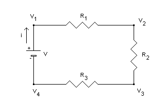
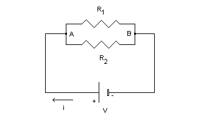
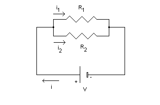

# VETTORI

#### SOMMA

Dati due vettori $\overrightarrow{v}=(x_1, y_1)$ e $\overrightarrow{w}=(x_2,y_2)$ la loro somma è un *vettore* avente per **componenti** la somma delle componenti di $v$ e $w$:

$\overrightarrow{v}+\overrightarrow{w}=(x_1+x_2, y_1+y_2)$ (regola del parallelogramma)

- Il **modulo** di $|\overrightarrow{v}+\overrightarrow{w}|\le  |\overrightarrow{v}|+|\overrightarrow{w}|$ 
- $|\overrightarrow{v}|=\sqrt{x^2+y^2+...}$ somma dei quadrati di ogni componente.

#### MOLTPIPLICAZIONE per uno *scalare*

Dati il vettore $\overrightarrow{v}=(x,y)$ ed il numero reale $\lambda$, il vettore $\lambda\overrightarrow{v}$ ha per componenti quelle del del vettore $\overrightarrow{v}$ moltiplicate per $\lambda$:

$\lambda\overrightarrow{v}=(\lambda x, \lambda y)$

Esempio: sia $\overrightarrow{v}=(1,2)$, determinare $2\overrightarrow{v}$ e $-\overrightarrow{v}$.

- $2\overrightarrow{v} = (2\times1,2\times2)=(2,4)$

- $-\overrightarrow{v} = (-1\times1,-1\times2)=(-1,-2)$

- $-\overrightarrow{v}$ è l'**opposto** di $\overrightarrow{v}$. Ovvero il **verso** si inverte perché moltiplicato per un numero **negativo**.

#### Prodotto scalare e angolo tra vettori

Dati due vettori $\overrightarrow{v}=(x_1, y_1)$ e $\overrightarrow{w}=(x_2,y_2)$ il loro **prodotto scalare**, che si indica con la notazione $\overrightarrow{v}\times\overrightarrow{w}$, è assegnato dalla seguente formula:

- $\overrightarrow{v}\times\overrightarrow{w}= x_1 \times x_2 + y_1 \times y_2$ che è **numero reale**
  - $x_1=|\overrightarrow{v}|\cos\Theta_1$
  - $x_2=|\overrightarrow{w}|\cos\Theta_2$
  - $y_1=|\overrightarrow{v}|\sin\Theta_1$
  - $y_2=|\overrightarrow{w}|\sin\Theta_1$

$\overrightarrow{v}\times\overrightarrow{w}= x_1 \times x_2 + y_1 \times y_2 = |\overrightarrow{v}|\cos\Theta_1 \times |\overrightarrow{w}|\cos\Theta_2+|\overrightarrow{v}|\sin\Theta_1 \times |\overrightarrow{w}|\sin\Theta_2$
$=|\overrightarrow{v}|\times|\overrightarrow{w}|\times(\cos\Theta_1\cos\Theta_2+\sin\Theta_1\sin\Theta_2)$
$=|\overrightarrow{v}|\times|\overrightarrow{w}|\times\cos(\Theta_2-\Theta_1) = |\overrightarrow{v}|\times|\overrightarrow{w}| \times\cos\alpha$

- $\Theta_1$ è l'angolo del vettore $\overrightarrow{v}$
- $\Theta_2$ è l'angolo del vettore $\overrightarrow{w}$

Segue che:
  - $\overrightarrow{v}\times\overrightarrow{w}> 0\iff \alpha$ è **minore** di 90°
  - $\overrightarrow{v}\times\overrightarrow{w}< 0\iff \alpha$ è **meggiore** di 90°
  - $\overrightarrow{v}\times\overrightarrow{w}= 0\iff \alpha$ **retto** (vettori **perpendicolari**) oppure uno dei due è il vettore **nullo**

**Angolo tra due vettori**

Per calcolare l'angolo tra due vettori si deve trovare l'angolo tra **ogni** vettore e l'asse delle $x$, dopo si fa la differenza tra gli angoli.
Angolo con l'asse delle $x$: $\Theta_{v_1}=\arcctg(\frac{j}{i})$

Esempio:
$\overrightarrow{v_1} = 15\overrightarrow{i} - 8\overrightarrow{j}$
$\overrightarrow{v_2} = 8\overrightarrow{i} - 15\overrightarrow{j}$

Angolo tra $v_1$ e $v_2$ con l'asse delle $x$:

$\Theta_{v_1}=\arcctg(\frac{-8}{15})$
$\Theta_{v_2}=\arcctg(\frac{-15}{8})$

Angolo tra $v_1$ e $v_2$: $\Theta_{v_1}-\Theta_{v_2}$

**NOTA**: $\frac{\pi}{2}$ è l'angolo di 90°.

#### Calcolo vettori

Dati due punti $A=(x,y)$ e $B=(x,y)$. Per determinare il **vettore** $\overrightarrow{r}_{AB}$ si fa la somma delle differenze dei componenti **arrivo - partenza**:

$\overrightarrow{r}_{AB} = (x_B-x_A)\overrightarrow{i} + (y_B-y_A)\overrightarrow{j}$

#### VERSORI

Il versore $r$ si trova dividendo il vettore $\overrightarrow{r}$ per il suo modulo $r$:

$r=\frac{\overrightarrow{r}}{r}$

#### DIFFERENZA

Somma della differenza tra le componenti. Esempio:

Siano dati:
$\overrightarrow{a} = 0\overrightarrow{i}-3\overrightarrow{j}$
$\overrightarrow{b} = 4\overrightarrow{i}+0\overrightarrow{j}$

La loro differenza:
$\overrightarrow{a}-\overrightarrow{b} = (0-4)\overrightarrow{i}+(-3+0)\overrightarrow{j} = -4\overrightarrow{i}-3\overrightarrow{j}$

\pagebreak

# ELETTROMAGNETISMO

## CARICHE

Corrente Elettrica è la carica totale che passa per un filo in un periodo di tempo.

Per la **legge della conservazione** della carica il voltaggio totale erogato dal sistema è uguale alla somma di tutti i cali del circuito.??

- Delle resistenze in serie vengono attraversate dalla stessa **intesità** di corrente ($A$, ampere)

- **Potenziale** è **in un punto** (per esempio all'inizio di un resistore).
  **Differenza di potenziale** $=$ Potenziale in punto $A$ $-$ Potenziale in punto $B$
- **Tensione** $=$ **differenza di potenziale** in $V$ (volt)
  - $V=Ri$
  - $i=\frac{V}{R}$
  - $R=\frac{V}{iz}$

- Tensioni su due resistori in parallelo sono medesime
- La corrente che circola nei resistori è sempre la stessa, cambia la tensione tra un capo e un altro.

Una $f.e.m.$ di $x\ V$ (volt) vuol dire che ai capi, ha una differenza di potenziale di $x$

**Conservazione dell'energia**

Con resistenze maggiori si ha un calo maggiore di voltaggio (del potenziale)
Con resistenze minori si ha un calo minore

#### GENERATORE

Un generatore di tensione, è caratterizzato da una **differenza di potenziale** ai suoi capi denominata **forza elettromotrice** e si tratta di una tensione elettrica misurata in $V$ (volt).

- Una f.e.m. di $10V$ vuol dire che la **differenza di potenziale** tra il polo positivo e il polo negativo è di $10V$. Che è anche la tensione erogata dal generatore.

Il generatore di tensione, sarà in grado di erogare una corrente $I$ solo una volta che il circuito sarà chiuso su di un carico (resistenza) $R$. 
Se il generatore rimane flottante **non** vi sarà alcuna corrente circolante.

- $f.e.m.$ in $V$ (volt): forze elettro-motrici (*tensioni* ai capi dei **generatori**)
- $c.d.t.$ in $V$ (volt): cadute di tensione (*tensioni* ai capi delle **resistenze**)

**TENSIONE** = $d.d.p.$ differenza di potenziale (elettrico)

#### RESISTORI IN SERIE

E' importante infine riassumere ciò che caratterizza un circuito di **resistori collegati in serie**:    

  1. nei singoli resistori e nel generatore stesso circola la medesima corrente (es. $2A$, rimane uguale per tutti)
  2. la somma delle cadute di potenziale ai capi dei resistori eguaglia la tensione del generatore (la caduta di potenziale ai capi dei resistori è **diversa** per ciascun resistore)
  3. la resistenza equivalente (totale) è data dalla somma delle resistenze

#### RESISTORI IN PARALLELO

- **Ai capi ($A$ e $B$) dei due resistori vi è la medesima tensione** che è quella del generatore. Questo fatto caratterizza i resistori collegati in parallelo.

- Dentro i due resistori circoleranno correnti in generali **diverse** la cui somma, a causa del principio di conservazione della carica, uguaglierà la corrente complessiva che passa nel generatore.

Avremo: 

Le due **correnti** sono immediatamente **calcolabili**:
- $i_1=\frac{V}{R_1}$
- $i_2=\frac{V}{R_2}$
 
essendo la **tensione** ai **capi** dei due **resistori** la **stessa**, ovvero la **tensione** $V$ del **generatore**.

La corrente $i$ che attraversa il circuito si trova tenendo conto di tutte le resistenze. 

#### CONDENSATORE

Ha la capacità di immagazzinare energia elettrica tra le sue armature

- **Circuito (interruttore) aperto** $\rArr$ **non passa corrente**
- **Circuito (interruttore) chiuso** $\rArr$ **passa corrente**

- **Condensatore scarico** + **circuito chiuso** (interruttore chiuso, quindi passa corrente) $\rArr$ passa corrente attraverso il Condensatore **finché** esso non sarà **carico**.
- **Condensatore carico** $\rArr$ **non passa** corrente (si comporta come un circuito aperto)

#### INDUTTORE

è il **duale** del Condensatore.

**Corto circuito** $=$ **Circuito chiuso** $\rArr$ **resistenza prossima allo 0** quindi passa corrente.

**STAZIONAREITÀ**:

- **Condensatore** 
   - **Carico** non passa corrente
- **Induttore** $\rArr$ **corto circuito** / **circuito chiuso**

**NON STAZIONAREITÀ**:

- **Condensatore** 
  - in **scarica** passa corrente (diventa un generatore)
  - in **carica** passa corrente
  - In **parallelo** con Resistore: resistore si **annulla**
- **Induttore** $\rArr$  **non passa corrente** (circuito aperto) 

In **parallelo** con Resistore:

### Esercizio 2

- **Calcolo potenziale elettrico in un punto**:
  Il potenziale elettrico in un punto è dato dalla somma dei potenziali (di altri punti) che agiscono su quel punto.
  - 1 punto: $k_e\frac{q}{r}$
  - 2 punti (somma): $k_e\frac{q_1}{r_1}+k_e\frac{q_2}{r_2}$
- **Calcolo campo elettrico** in un punto o **forza nulla** in un punto:
  Il campo elettrico in un punto è dato dalla somma dei campi elettrici (di altri punti) in quel punto.
  - 1 punto: $k_e\frac{Q}{|r_1-r_2|^2}$
  - 2 punti: $k_e\frac{Q_1}{|r_1-r_2|^2}+k_e\frac{Q_2}{|r_2-r_3|^2}$
  
  Se **la forza è nulla** allora i campi elettrici che agiscono in quel punto si annullano, quindi la loro somma è uguale a $0$
- calcolo del campo magnetico in un punto
- forza totale su una carica che si muove con una velocità
- calcolo del campo elettrico generato 
